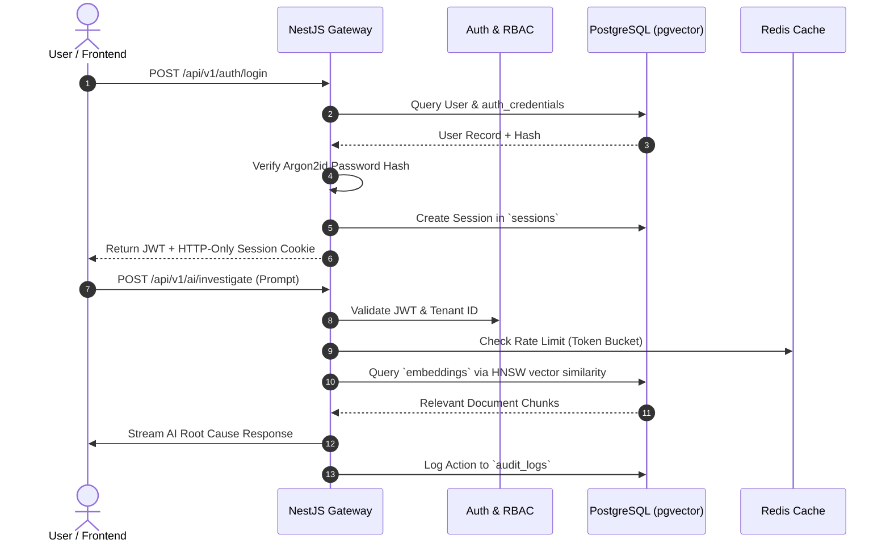

# Database Data Flow Diagram

```mermaid
sequenceDiagram
    autonumber
    actor Client as User / Frontend
    participant API as NestJS Gateway
    participant Auth as Auth & RBAC
    participant DB as PostgreSQL (pgvector)
    participant Redis as Redis Cache

    Client->>API: POST /api/v1/auth/login
    API->>DB: Query User & auth_credentials
    DB-->>API: User Record + Hash
    API->>API: Verify Argon2id Password Hash
    API->>DB: Create Session in `sessions`
    API-->>Client: Return JWT + HTTP-Only Session Cookie

    Client->>API: POST /api/v1/ai/investigate (Prompt)
    API->>Auth: Validate JWT & Tenant ID
    API->>Redis: Check Rate Limit (Token Bucket)
    API->>DB: Query `embeddings` via HNSW vector similarity
    DB-->>API: Relevant Document Chunks
    API->>Client: Stream AI Root Cause Response
    API->>DB: Log Action to `audit_logs`
```
